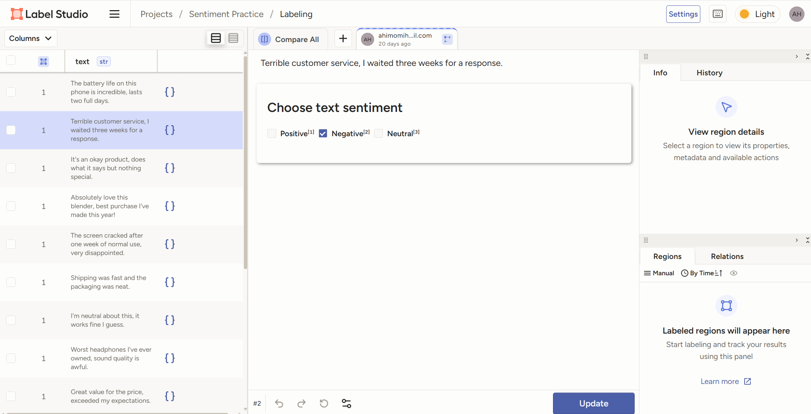
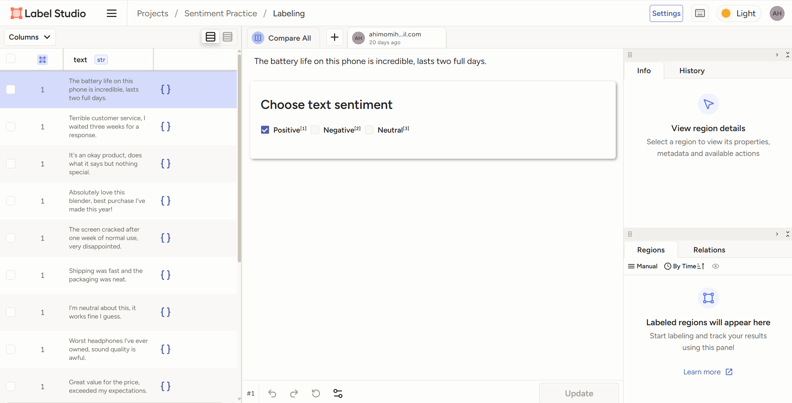
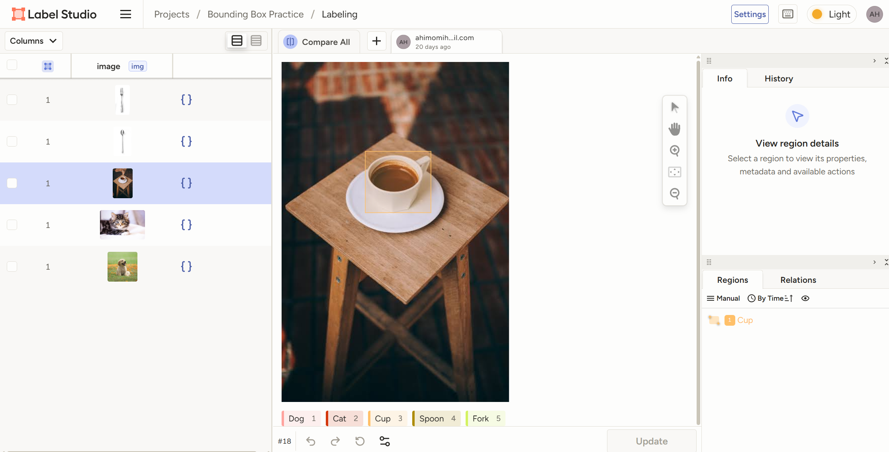
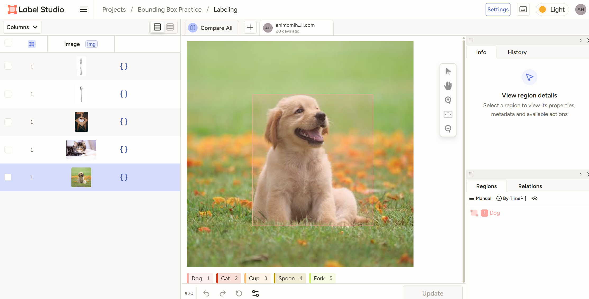

# AI Data Annotation Portfolio

Self-directed practice samples demonstrating core AI data annotation skills, built in preparation for AI data annotation / data labeling roles.

## Contents
- Fact Verification (AI-output fact-checking)
- Text Classification (Sentiment)
- Image Bounding Boxes (Object Detection)

---

## 1. Fact Verification

Sample fact-verification exercise demonstrating source-based claim validation methodology: cross-referencing AI-generated claims against authoritative sources (encyclopedic, academic, and major news outlets), with documented rationale for each verdict.

| Claim | Verdict | Source | Rationale |
|---|---|---|---|
| The Great Wall of China is visible from space with the naked eye. | Incorrect | [NIH](https://pmc.ncbi.nlm.nih.gov/articles/PMC3972694/) | Not even the best human eyes could see the Great Wall from space; limited by the eye's resolution for small, diffuse objects. |
| Tesla was founded by Elon Musk in 2003. | Incorrect | [Investopedia](https://www.investopedia.com/articles/personal-finance/061915/story-behind-teslas-success.asp) | Tesla Motors was founded by engineers Martin Eberhard and Marc Tarpenning in 2003; Musk joined later as an investor/chairman. |
| Humans share approximately 50% of their DNA with bananas. | Almost Correct | [Pfizer](https://www.pfizer.com/news/articles/how_genetically_related_are_we_to_bananas) | Actual figure is 60%+; shared "housekeeping" genes for basic cellular function. |
| Indonesia is made up of more than 17,000 islands. | Correct | [World Bank](https://www.worldbank.org/ext/en/country/indonesia) | Confirmed: over 17,000 islands, 300+ ethnic groups. |
| Nokia was the world's largest mobile phone manufacturer until 2011. | Correct | [Gigazine](https://gigazine.net/gsc_news/en/20240317-nokia-made-too-many-phones/) | Confirmed by source. |
| The Eiffel Tower was originally intended to be a permanent structure when built in 1889. | Incorrect | [EBSCO](https://www.ebsco.com/research-starters/history/eiffel-tower-dedicated) | Built on a 20-year lease; was nearly torn down in 1909. |
| Glass is a slow-moving liquid, which is why old church windows are thicker at the bottom. | Incorrect | [Scientific American](https://www.scientificamerican.com/article/fact-fiction-glass-liquid/) | Glass is an amorphous solid, not a liquid; thickness variation is due to manufacturing methods, not flow. |
| Amazon started out exclusively as an online bookstore. | Correct | [NPR](https://www.npr.org/2024/07/05/nx-s1-5021888/amazon-is-30-heres-how-a-book-store-gobbled-up-all-of-e-commerce) | Confirmed: founded as an online bookstore in 1994. |
| Mount Everest's summit sits exactly on the border between Nepal and China. | Almost Correct | [National Geographic](https://www.nationalgeographic.com/adventure/article/how-the-everest-experience-is-different-in-china-versus-nepal) | Source specifies the border is with Tibet, not China directly — a notable terminology distinction. |
| The shortest war in recorded history lasted under 40 minutes, fought between Britain and Zanzibar. | Correct | [Britannica](https://www.britannica.com/event/Anglo-Zanzibar-War) | Anglo-Zanzibar War lasted no more than 40 minutes. |

---

## 2. Text Classification (Sentiment)

Labeled 15 product reviews for sentiment (Positive/Negative/Neutral), including ambiguous mixed-sentiment cases requiring judgment calls consistent with labeling guideline principles.

---

## 3. Image Bounding Boxes

Annotated object detection tasks with attention to box tightness, occlusion handling, and multi-object consistency — key quality metrics in production annotation QA.

---

*Built using [Label Studio](https://labelstud.io/) as part of self-directed practice for AI data annotation roles.*
